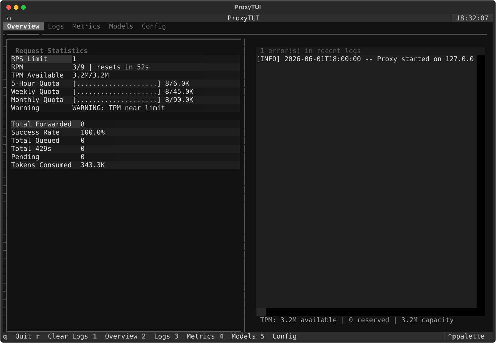
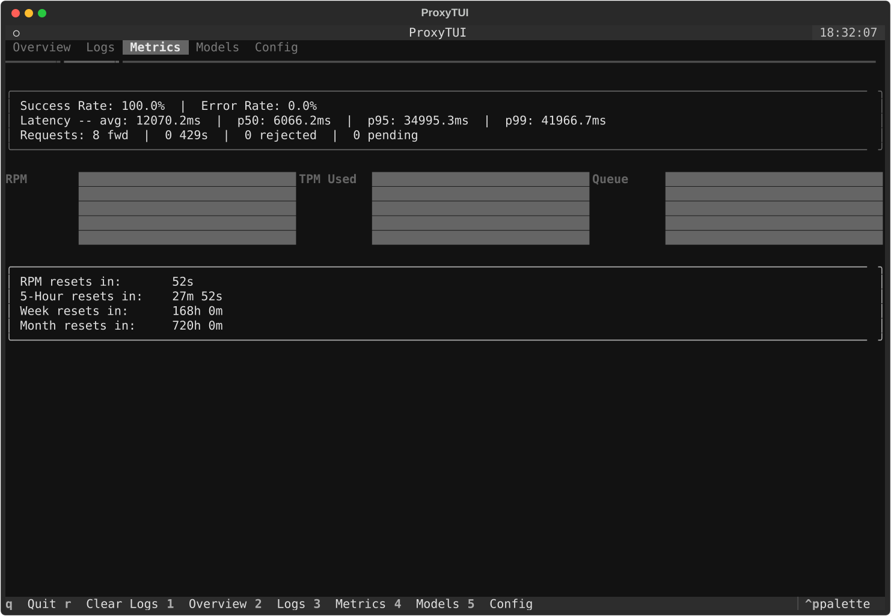
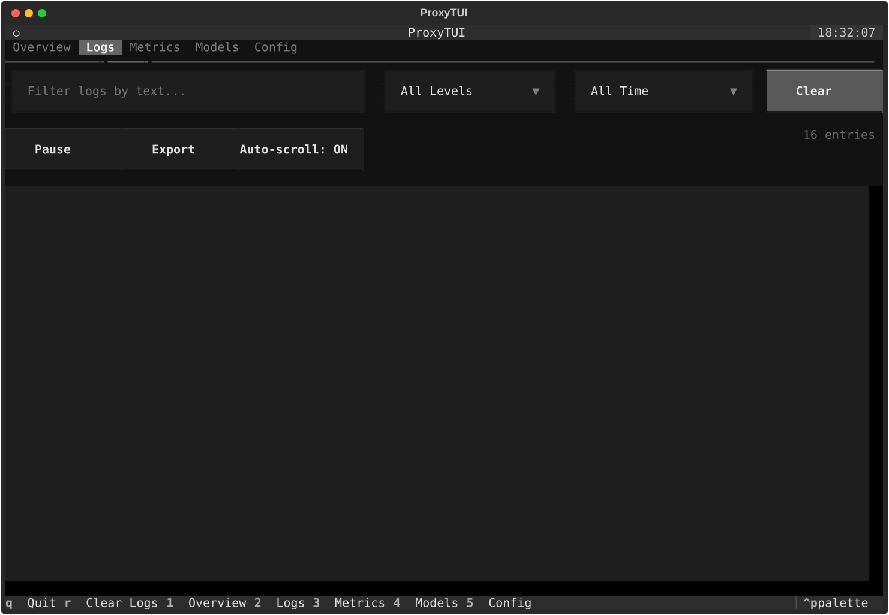
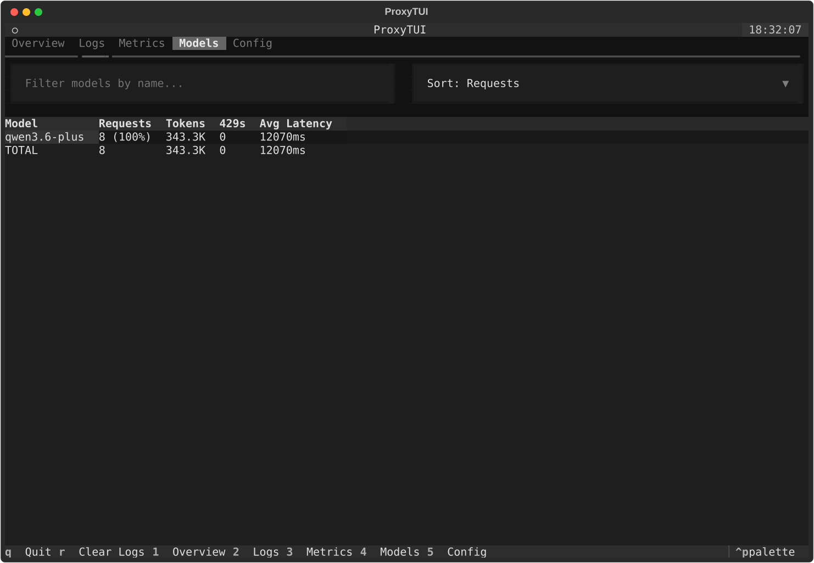
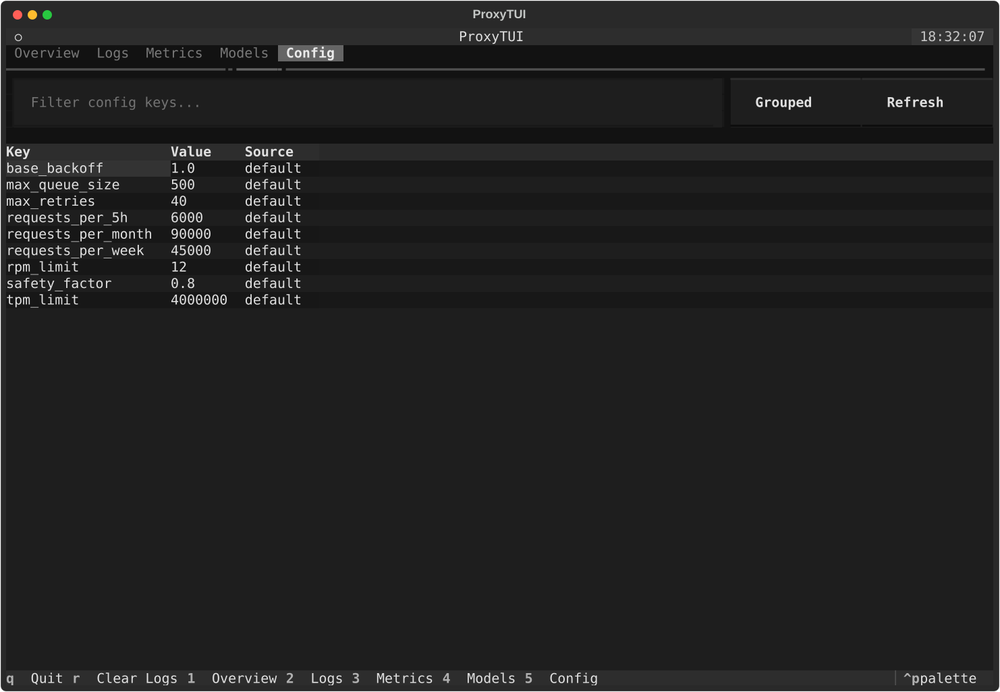

# Coding Plan Proxy

An HTTP proxy for the DashScope Coding API with rate limiting, request queuing, automatic retries, and a rich Textual TUI dashboard.

## Quick Start

```powershell
py -m venv .venv
.venv\Scripts\Activate.ps1
py -m pip install -r requirements.txt
# add your API key to .env (see .env.example)
py dashscope_proxy.py           # launches proxy + TUI dashboard
py dashscope_proxy.py --headless # launches proxy without TUI
```

Point your OpenAI-compatible client at `http://127.0.0.1:8899`.

## TUI Dashboard

Run the proxy to launch the interactive TUI dashboard. Monitor rate limits, quotas, request metrics, live logs, per-model usage, and configuration in real time.

### Overview Tab

Real-time rate limiter status, RPM/TPM/quotas with progress bars, connection status, and request statistics (success rate, rejected, pending/max queue). Non-primary providers appear as soon as they are configured, including at zero traffic. Live log feed of warnings and errors.



### Metrics Tab

Sparkline charts for RPM, tokens-per-minute, queue depth, and upstream latency. Derived metrics (success rate, latency percentiles), failover events, and a latency histogram.



### Logs Tab

Full log viewer with text search, level filtering, time range selection, pause/resume, auto-scroll toggle, and export to file.



### Models Tab

Per-model usage breakdown: request count with percentage, tokens, 429 errors, average latency, and totals row. Sortable by requests, tokens, latency, or 429s.



### Config Tab

Grouped network, timeout, connection, buffering, logging, and per-provider limit blocks. Filter by key; source column shows env vs default.



### Keyboard Shortcuts

| Key | Action |
|-----|--------|
| `1` | Overview tab |
| `2` | Logs tab |
| `3` | Metrics tab |
| `4` | Models tab |
| `5` | Config tab |
| `r` | Clear logs |
| `q` | Quit |

## Features

### Rate Limiting & Quotas

**Multi-layer rate limiting**
Enforces RPS, RPM, TPM (via Token Bucket), and quotas over 5-hour, weekly, and monthly windows. A configurable safety factor keeps usage below the hard limits.

**TPM token lifecycle**
TPM is enforced via a Token Bucket with reserve/reconcile/refund semantics. Tokens are reserved before sending to upstream, reconciled with real token counts after the response, and refunded on errors or client disconnects.

**Deadline-bounded queue waits**
Queue waits respect a configurable deadline (default 120s). The proxy checks for client disconnects between wait iterations and aborts queued requests if the deadline is exceeded.

### Resilience

**Automatic retries**
Retries 429 and 5xx responses with exponential backoff and jitter.

**Request queuing**
Requests that exceed rate limits are placed in a bounded queue instead of failing immediately.

**Circuit breaker**
Opens circuit on repeated upstream failures, preventing cascade failures and allowing recovery.

### Request Handling

**Developer role mapping**
Converts `developer` role messages to `system` for upstream compatibility.

**SSE streaming**
Streams completions through the proxy and aborts if the client disconnects.

**Hop-by-hop header stripping**
Removes connection-specific headers before forwarding to upstream.

**Client disconnect detection**
Detects when clients disconnect and refunds TPM tokens, cancels pending requests.

**Session logging**
All requests and responses are logged to `session_logs/` for audit and debugging.

### Mock & Diagnostics

**Mock model list**
`GET /v1/models` returns a static list of supported models.

**Interactive TUI dashboard**
Five-tab dashboard with live metrics, sparkline charts, log viewer with filters, per-model analytics, and configuration viewer. Keyboard-driven navigation.

## Endpoints

| Endpoint | Description |
|---|---|
| `POST /v1/chat/completions` | Chat completions, proxied through the rate limiter |
| `GET /v1/models` | Local mock model catalog |
| `GET /v1/proxy/status` | Current rate limiter metrics (RPM usage, queued requests, totals) |
| `GET /health` | Simple health check |
| `GET /ready` | Readiness probe (checks upstream connection) |

## Configuration

Tweak `CODING_PLAN_CONFIG` in `dashscope_proxy_lib/config.py` to match your plan:

| Setting | Default | Description |
|---|---|---|
| `rpm_limit` | 9 | Max requests per minute (before safety factor) |
| `tpm_limit` | 4,000,000 | Max tokens per minute |
| `safety_factor` | 0.8 | Multiply all limits by this (0.8 = leave 20% headroom) |
| `requests_per_5h` | 6000 | Rolling 5-hour request cap |
| `requests_per_week` | 45000 | Weekly request cap |
| `requests_per_month` | 90000 | Monthly request cap |
| `max_queue_size` | 500 | Max requests waiting in queue |
| `max_retries` | 40 | Max retries on 429 responses |
| `base_backoff` | 1.0 | Base seconds for exponential backoff |

The defaults match DashScope's Coding Plan tiers — you usually only need to adjust `safety_factor`.

## Running Tests

```powershell
py -m pytest tests/
```
